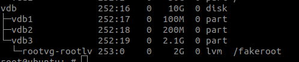
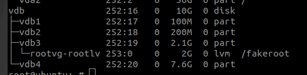
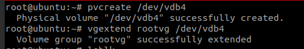
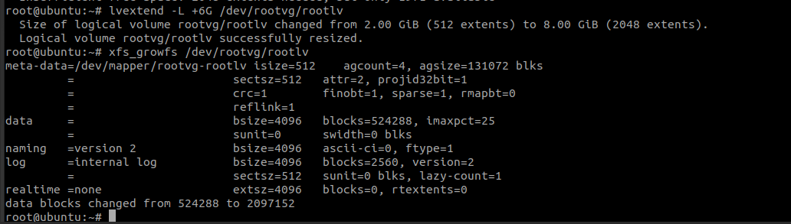
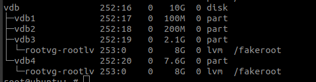

# EXTEND ROOT
## Environment
Created a fakeroot for demonstration, currently there is about 7G of free space on vdb.




### 1.Create a Sub-partition
Create a new partition vdb4 with the remaining space. 

As you are using sda, run`(echo n;echo p; echo "";echo ""; echo w) | sudo fdisk /dev/sda`to create the partition




Use `lsblk` to check if the partition was created successfully.

### 2.Extend root using LVM commands


Create vdb4 as a physical volume (pv) and add it to the rootvg volume group.

```
pvcreate /dev/sda4
vgextend rootvg /dev/sda4
```


This will extend the fakeroot by 6G. You can adjust the size as needed, then run xfs_growfs to update the file system:

```
lvextend -L +6G /dev/rootvg/rootlv
xfs_growfs /dev/rootvg/rootlv
```
Notes:  
- 1.You can repeat these two commands to further extend the file system. Note that XFS does not support shrinking by default, so expand according to your needs.

- 2.You can also expand other directories such as /home and /var by checking the mapping files under /dev/rootvg/ as needed. 




Use `lsblk` to verify if the extension was successful.